# DenrimRendererKit

DenrimRendererKit is a [MoonRay](https://openmoonray.org/)-inspired Swift Package for high-quality Metal path tracing on Apple platforms. It is built for Denrim products, but the repository is kept useful as a standalone renderer: you can load scripted scenes, render material previews, benchmark backends, and use the Swift API directly from an app or tool.

The renderer and material system are shaped by MoonRay-style production rendering ideas: physically based layered materials, predictable scriptable scenes, useful diagnostics, and a path toward a polished Apple-native offline/preview renderer. DenrimRendererKit is not a MoonRay port or shader-compatible implementation; it uses MoonRay as a quality and material-design reference.

## Features

* Progressive Metal path tracer with flat BVH fallback and Metal ray tracing traversal on supported devices.
* `denrim` CLI for rendering `.denrim` SceneScript files and built-in material previews.
* SceneScript with script-relative assets, includes, mesh instances, render defaults, and readable grouped arguments.
* OBJ and PLY mesh loading with preserved normals and UVs.
* ImageIO texture loading with explicit sRGB/linear handling, checker/solid/generated textures, and tangent-space normal maps.
* Direct emissive-triangle lighting, HDRI environment sampling, and benchmark timing reports.
* Rough dielectric, metal, clearcoat, thin-film, sheen/fuzz, transmission, absorption, volume scattering, and random-walk subsurface controls.
* Built-in material preset catalog with generated preview thumbnails.
* Beauty, depth, normal, albedo, material ID, object ID, and motion-vector outputs.
* Unit, parser, backend parity, AOV, and render smoke tests.

## DiningRoom Preview

[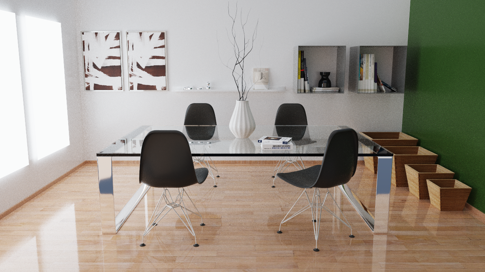](Examples/Renders/DiningRoom.png)

The DiningRoom scene lives at `Examples/SceneScripts/Quality/DiningRoom/dining-room.denrim`. It carries render defaults in the script itself:

```text
render output ../../../Renders/DiningRoom.png size hd spp 512 quality final backend automatic
```

Run it with:

```sh
swift run -c release denrim -- Examples/SceneScripts/Quality/DiningRoom/dining-room.denrim
```

For a quick smoke render, override the script defaults:

```sh
swift run denrim -- Examples/SceneScripts/Quality/DiningRoom/dining-room.denrim \
    --output /tmp/denrim-dining-room.png \
    --width 320 \
    --height 180 \
    --samples 1 \
    --quality interactive
```

## Materials

Built-in materials are exposed through `BuiltInMaterialLibrary` and SceneScript's `material name preset preset-id` form. The thumbnails below are generated with `Examples/Tools/render-built-in-materials.sh`.

| Preview | Preset | Category | Description |
| --- | --- | --- | --- |
| 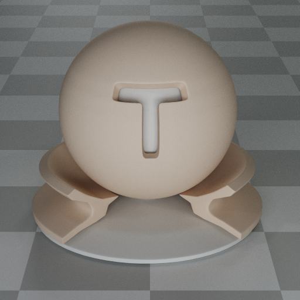 | `matte.clay` | Diffuse | Warm neutral diffuse clay for model previews. |
| 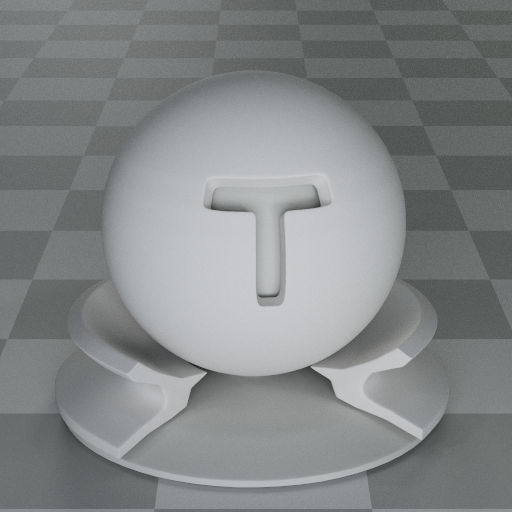 | `matte.paper` | Diffuse | Soft off-white paper with low specular response. |
| 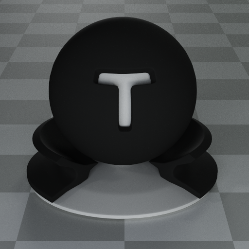 | `matte.charcoal` | Diffuse | Dark rough diffuse surface. |
| 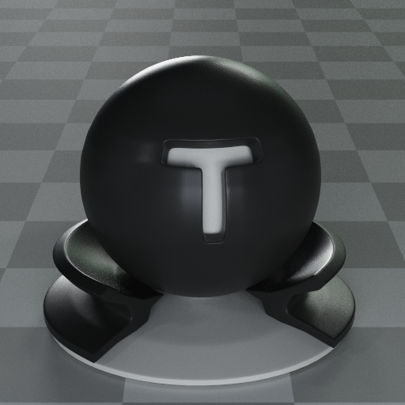 | `plastic.soft-black` | Plastic | Dark plastic with readable broad highlights. |
| 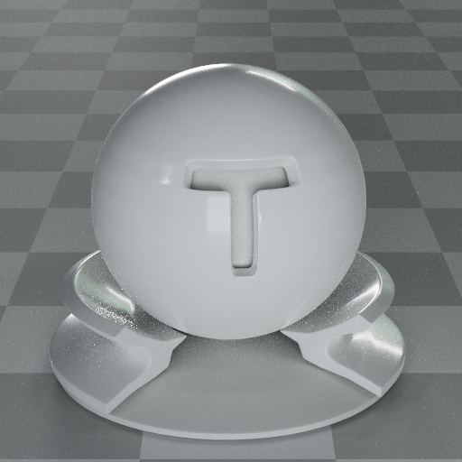 | `plastic.gloss-white` | Plastic | White molded plastic with a clear glossy coat. |
| 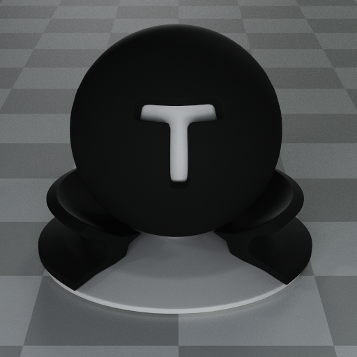 | `rubber.black` | Plastic | Very rough black rubber. |
| 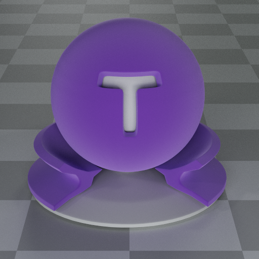 | `fabric.velvet-purple` | Fabric | Velvet-like fabric using the sheen/fuzz lobe. |
| 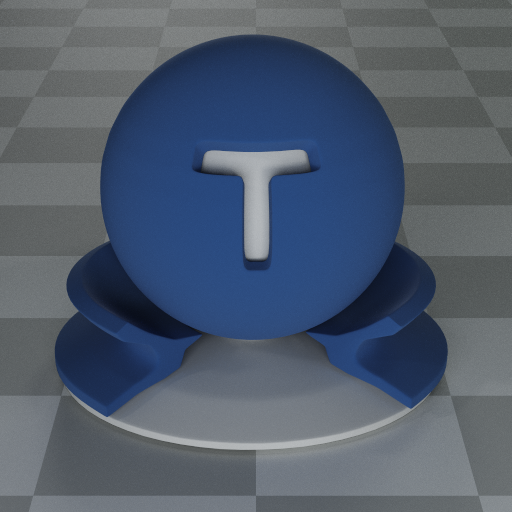 | `fabric.denim-blue` | Fabric | Rough blue fabric with a gentle grazing sheen. |
| 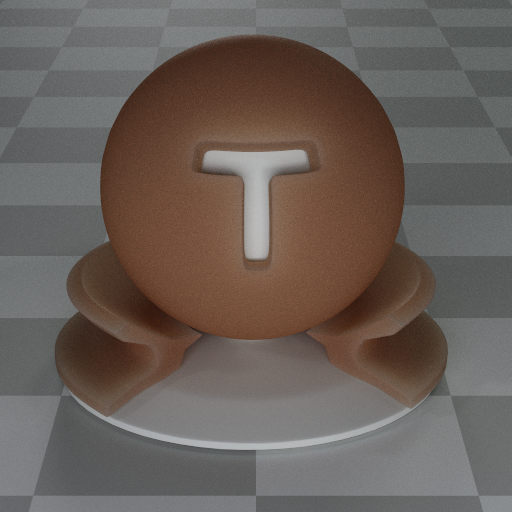 | `subsurface.skin-warm` | Subsurface | Warm organic random-walk subsurface scattering. |
| 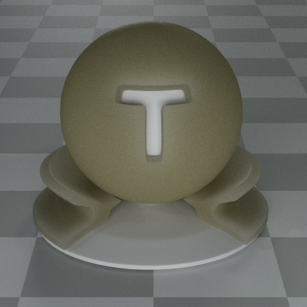 | `subsurface.wax-cream` | Subsurface | Soft creamy wax with broad internal scattering. |
| 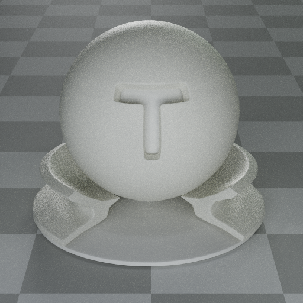 | `liquid.milk` | Liquid | Cloudy refractive liquid with absorption and volume scattering. |
| 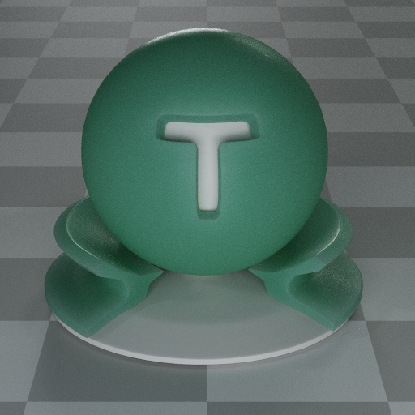 | `subsurface.jade-green` | Subsurface | Dense green stone with colored multiple scattering. |
| 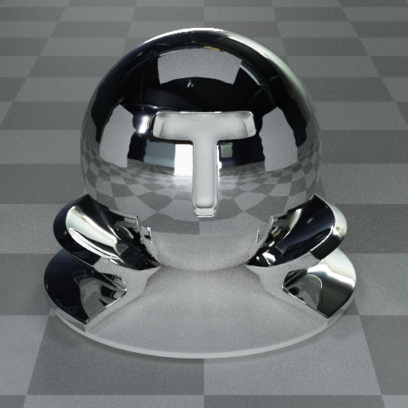 | `metal.chrome` | Metal | Polished neutral mirror-like metal. |
| 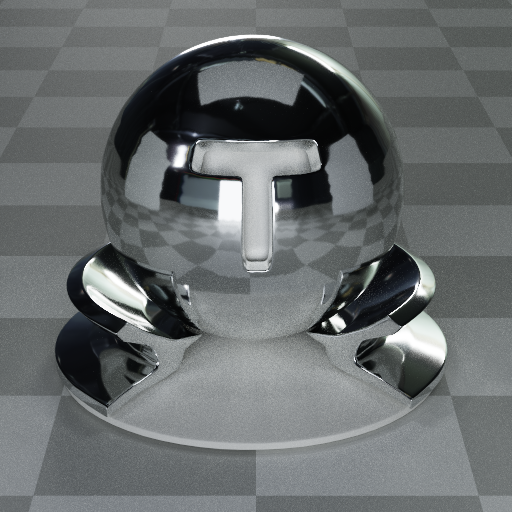 | `metal.aluminum` | Metal | Clean bright aluminum. |
| 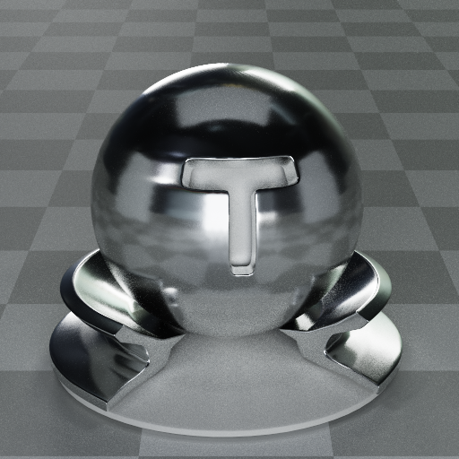 | `metal.brushed-aluminum` | Metal | Anisotropic satin aluminum. |
| 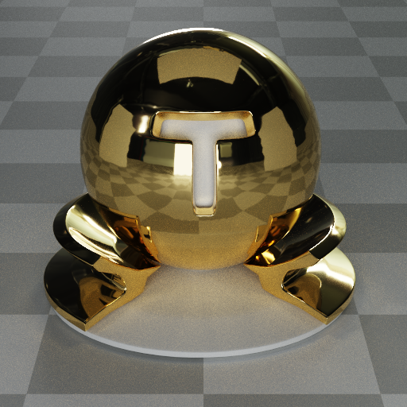 | `metal.gold` | Metal | Polished warm gold. |
| 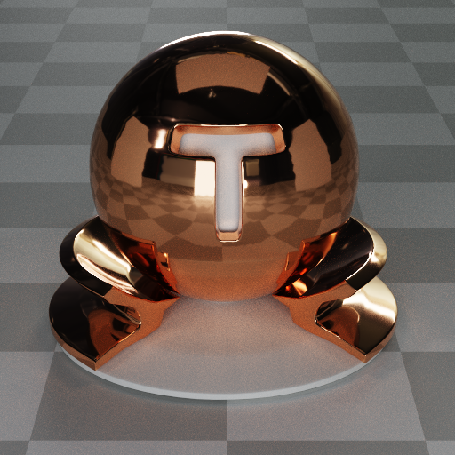 | `metal.copper` | Metal | Polished copper. |
|  | `coating.car-red` | Coating | Glossy red paint with a clearcoat layer. |
| 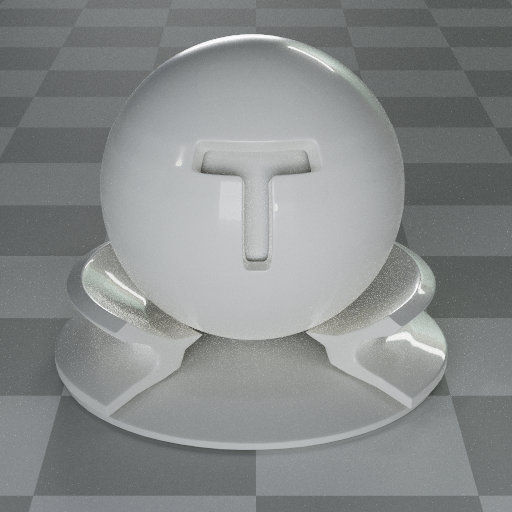 | `coating.pearl-white` | Coating | Bright coated paint with subtle warm clearcoat tint. |
| 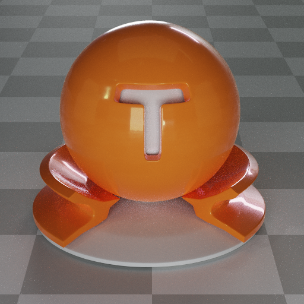 | `coating.iridescent-amber` | Coating | Glossy amber coated surface with thin-film color shift. |
| 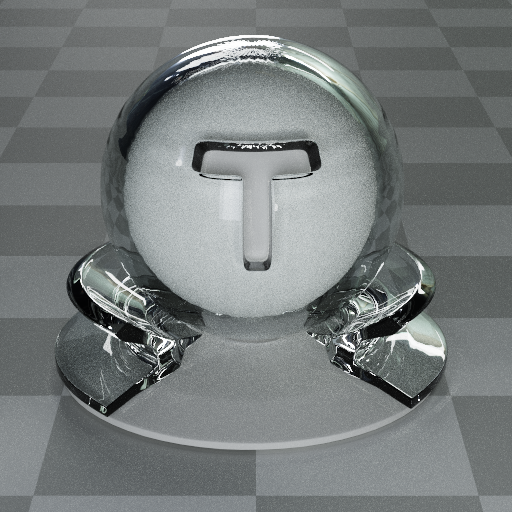 | `glass.clear` | Glass | Clear solid dielectric glass. |
| 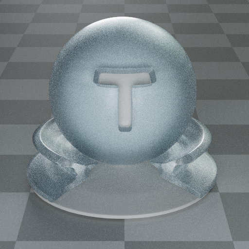 | `glass.frosted` | Glass | Rough transmissive glass. |
| 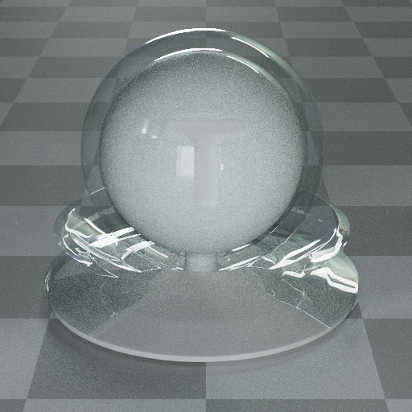 | `glass.thin-pane` | Glass | Zero-thickness glass pane for windows and tabletops. |
| 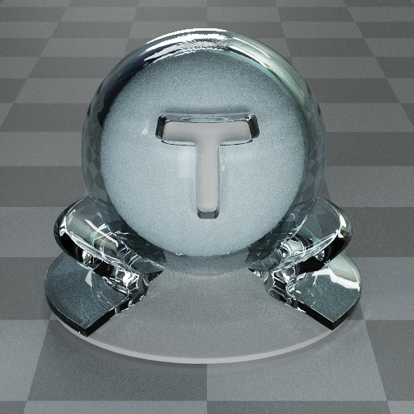 | `liquid.water` | Liquid | Clear water with IOR 1.333. |
| 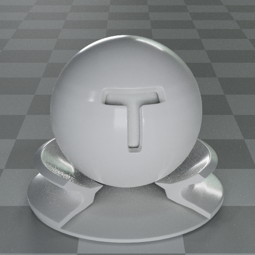 | `ceramic.white` | Ceramic | Glazed white ceramic. |
| 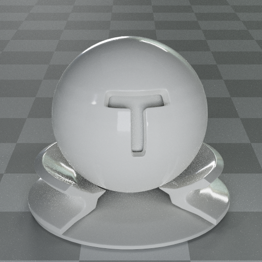 | `ceramic.porcelain` | Ceramic | Smooth porcelain with soft off-white tint. |
| 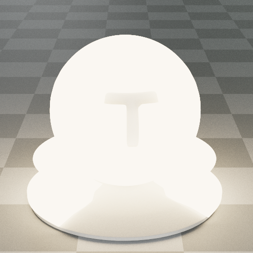 | `emission.warm-panel` | Emission | Warm white area-light material. |
| 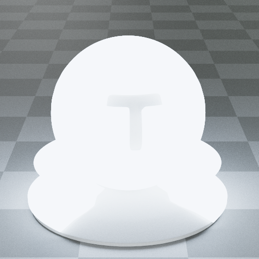 | `emission.cool-panel` | Emission | Cool white area-light material. |

Render a material preview directly:

```sh
swift run denrim -- material matte.clay --samples 64 --quality interactive
swift run denrim -- material liquid.milk --samples 1024 --quality final
```

Refresh the material gallery:

```sh
./Examples/Tools/render-built-in-materials.sh
```

## Swift API

```swift
import DenrimRendererKit

let renderer = try DenrimRenderer()
let scene = RenderScene.cornellBox()
let session = try renderer.makeSession(
    scene: scene,
    settings: RenderSettings(width: 512, height: 512, maxBounces: 4)
)

try session.render(samples: 64, to: outputURL)
```

Use built-in material presets from Swift:

```swift
let material = BuiltInMaterialLibrary.material(named: "metal.brushed-aluminum")
let previews = BuiltInMaterialLibrary.previews
```

Load a scripted scene:

```swift
let sceneURL = URL(fileURLWithPath: "Examples/SceneScripts/Quality/DiningRoom/dining-room.denrim")
let scene = try SceneScript.parse(contentsOf: sceneURL)
let defaults = scene.renderDefaults
```

## SceneScript And CLI

`denrim` renders `.denrim` SceneScript files, resolves relative assets beside the script, writes PNG output, prints progress during normal renders, and prints benchmark timings at the end. Scripts can carry render defaults; explicit CLI flags override them.

```sh
swift run denrim -- Examples/SceneScripts/Quality/DiningRoom/dining-room.denrim
swift run denrim help render
swift run denrim help material
```

Useful render options:

```sh
swift run denrim -- Examples/SceneScripts/MaterialVariants/glossy-metal-reference.denrim \
    --output /tmp/glossy.png \
    --samples 64 \
    --quality interactive \
    --backend automatic
```

Use `--output-type depth|normal|albedo|material-id|object-id|motion-vector` to export AOVs, `--denoise apple-svgf` or `--denoise simple` for denoiser comparisons, `--backend flat-bvh|metal-ray-tracing` for backend measurements, and `--report-output report.json` or `--json` for benchmark JSON. `--json` suppresses progress output so stdout stays parseable.

## Testing

```sh
swift test
```

Performance benchmarks are intentionally separate from normal tests:

```sh
DENRIM_RUN_PERFORMANCE_TESTS=1 swift test --filter PerformanceBenchmarkTests
```

## Documentation

* [Materials](Documentation/Materials.md)
* [SceneScript](Documentation/SceneScript.md)
* [Performance](Documentation/Performance.md)
* [Testing](Documentation/Testing.md)

## License

DenrimRendererKit is released under the [Apache License 2.0](LICENSE).
